# 🏭 AI-Enabled Industrial Motor Monitoring System

<div align="center">


### **🚀 Real-time industrial motor monitoring with AI-powered predictive maintenance**

[**Live Demo**](https://demo.motor-monitoring.com) • [**Documentation**](docs/) • [**Report Bug**](https://github.com/your-username/ai-motor-monitoring/issues) • [**Request Feature**](https://github.com/your-username/ai-motor-monitoring/issues)


</div>

---

## 🎯 **Overview**

The **AI-Enabled Industrial Motor Monitoring System** is a cutting-edge IoT solution that revolutionizes industrial motor maintenance through real-time monitoring, intelligent analytics, and predictive maintenance capabilities. Built with modern web technologies and industrial-grade hardware integration, it provides comprehensive insights into motor health, performance metrics, and operational efficiency.

### ✨ **Key Features**

<table>
<tr>
<td width="50%">

**🔥 Core Capabilities**
- ⚡ Real-time data streaming via WebSocket
- 📊 Multi-metric simultaneous visualization
- 🤖 AI-powered health scoring & predictions
- 🔧 Remote motor control capabilities
- 📈 Historical trend analysis
- 🚨 Intelligent alert system

</td>
<td width="50%">

**🛠️ Technical Highlights**
- 🌐 ESP8266 WiFi sensor integration
- 🏭 Mitsubishi FX5U PLC connectivity
- 💾 SQLite database with auto-backup
- 📱 Fully responsive web interface
- 🔌 RESTful API for integrations
- 🔒 Secure session management

</td>
</tr>
</table>

---

## ⚡ **Quick Start**

Get up and running in under 2 minutes!

```bash
# Clone the repository
git clone https://github.com/your-username/ai-motor-monitoring.git
cd ai-motor-monitoring

# Install dependencies
pip install -r requirements.txt

# Start the application
python main.py
```

🌐 **Access the dashboard at:** `http://localhost:5000`

---

## 📋 **Table of Contents**

- [🏗️ System Architecture](#️-system-architecture)
- [🔧 Installation](#-installation)
- [⚙️ Configuration](#️-configuration)
- [📊 Features](#-features)
- [🔌 Hardware Integration](#-hardware-integration)
- [📡 API Reference](#-api-reference)
- [🧠 AI & Analytics](#-ai--analytics)
- [🐛 Troubleshooting](#-troubleshooting)
- [🤝 Contributing](#-contributing)
- [📝 License](#-license)

---

## 🏗️ **System Architecture**

```mermaid
graph TB
    subgraph "🔧 Hardware Layer"
        ESP[ESP8266 Sensors]
        PLC[FX5U PLC]
        MOTOR[Motor]
    end
    
    subgraph "📡 Communication"
        HTTP[HTTP/REST]
        WS[WebSocket]
        TCP[TCP/IP]
    end
    
    subgraph "⚙️ Application Core"
        FLASK[Flask Server]
        AI[AI Engine]
        DB[(Database)]
    end
    
    subgraph "🖥️ User Interface"
        DASH[Web Dashboard]
        API[REST API]
    end
    
    ESP -->|WiFi| HTTP
    PLC -->|Ethernet| TCP
    HTTP --> FLASK
    TCP --> FLASK
    FLASK <--> AI
    FLASK <--> DB
    FLASK <--> WS
    WS <--> DASH
    FLASK --> API
```

<div align="center">



</div>

### 🛠️ **Technology Stack**

| Layer | Technologies | Purpose |
|-------|-------------|---------|
| **Backend** | Python 3.8+, Flask 2.3.3, Socket.IO 5.8.0 | Core application server |
| **Frontend** | Bootstrap 5.3, Chart.js 4.4, JavaScript ES6 | Interactive dashboard |
| **Database** | SQLite 3 | Data persistence |
| **Hardware** | ESP8266, Mitsubishi FX5U PLC | Sensor data collection |
| **Protocols** | HTTP, WebSocket, TCP/IP | Communication interfaces |

---

## 🔧 **Installation**

### 📋 **Prerequisites**

- ✅ Python 3.8 or higher
- ✅ 2GB RAM minimum
- ✅ Modern web browser
- ✅ Network connectivity for hardware

### 🚀 **Step-by-Step Installation**

<details>
<summary><b>1️⃣ Environment Setup</b></summary>

```bash
# Create virtual environment
python -m venv motor_env

# Activate environment
# Windows:
motor_env\Scripts\activate
# Linux/macOS:
source motor_env/bin/activate
```

</details>

<details>
<summary><b>2️⃣ Install Dependencies</b></summary>

```bash
# Core dependencies
pip install flask==2.3.3
pip install flask-socketio==5.8.0
pip install eventlet==0.33.3
pip install requests==2.31.0

# Optional: Advanced analytics
pip install numpy pandas
```

</details>

<details>
<summary><b>3️⃣ Configure Application</b></summary>

Create `config/config.yaml`:

```yaml
server:
  host: "0.0.0.0"
  port: 5000
  debug: false

database:
  type: "sqlite"
  path: "database/sensor_history.db"

hardware:
  esp8266:
    timeout: 30
  plc:
    timeout: 30
```

</details>

<details>
<summary><b>4️⃣ Run Application</b></summary>

```bash
# Start main application
python main.py

# Optional: Start simulators for testing
python simulators/esp_simulator.py
python simulators/plc_simulator.py
```

</details>

---

## ⚙️ **Configuration**

### 🔐 **Security Configuration**

```python
# config.py
SECRET_KEY = 'your-unique-secret-key-2025'
SESSION_COOKIE_SECURE = True  # Enable for HTTPS
SESSION_COOKIE_HTTPONLY = True
SESSION_COOKIE_SAMESITE = 'Lax'
```

### 🌐 **Network Settings**

| Port | Service | Description |
|------|---------|-------------|
| 5000 | Web Dashboard | Main application interface |
| 80/443 | HTTP/HTTPS | Optional web redirects |
| 502 | Modbus TCP | PLC communication |

---

## 📊 **Features**

### 🎛️ **Dashboard Components**

<table>
<tr>
<td width="33%">

#### 📈 **Real-time Monitoring**
- Live data streaming
- Multi-metric charts
- Instant updates
- Trend indicators

</td>
<td width="33%">

#### 🤖 **AI Analytics**
- Health scoring
- Predictive maintenance
- Anomaly detection
- Smart recommendations

</td>
<td width="33%">

#### 🔧 **Control Panel**
- Remote start/stop
- Emergency controls
- System reset
- Export reports

</td>
</tr>
</table>

### 📱 **Responsive Design**

| Device | Features | Optimization |
|--------|----------|--------------|
| 🖥️ **Desktop** | Full dashboard, multi-column layout | All features enabled |
| 📱 **Tablet** | Touch-optimized, responsive grid | Essential features |
| 📱 **Mobile** | Single column, core functionality | Performance optimized |

---

## 🔌 **Hardware Integration**

### 📡 **ESP8266 Setup**

<details>
<summary><b>View ESP8266 Arduino Code</b></summary>

```cpp
#include <ESP8266WiFi.h>
#include <ESP8266HTTPClient.h>
#include <ArduinoJson.h>

const char* ssid = "YOUR_WIFI_SSID";
const char* password = "YOUR_WIFI_PASSWORD";
const char* serverURL = "http://your-server:5000/api/send-data";

void setup() {
    Serial.begin(115200);
    WiFi.begin(ssid, password);
    while (WiFi.status() != WL_CONNECTED) {
        delay(1000);
    }
}

void sendSensorData() {
    HTTPClient http;
    WiFiClient client;
    
    StaticJsonDocument<300> doc;
    doc["VAL1"] = analogRead(A0) * 0.01;  // Current
    doc["VAL2"] = 27.5;                   // Voltage
    doc["VAL3"] = 2750;                   // RPM
    
    String jsonString;
    serializeJson(doc, jsonString);
    
    http.begin(client, serverURL);
    http.addHeader("Content-Type", "application/json");
    http.POST(jsonString);
    http.end();
}

void loop() {
    sendSensorData();
    delay(5000);
}
```

</details>

### 🏭 **PLC Data Format**

```json
{
    "motor_temp": 45.2,
    "motor_voltage": 24.1,
    "motor_current": 6.8,
    "motor_rpm": 2850,
    "power_consumption": 0.163
}
```

---

## 📡 **API Reference**

### 🔗 **REST Endpoints**

| Method | Endpoint | Description |
|--------|----------|-------------|
| `POST` | `/api/send-data` | Submit ESP8266 sensor data |
| `POST` | `/api/plc-data` | Submit PLC data |
| `GET` | `/api/current-data` | Retrieve current system data |
| `GET` | `/api/recommendations` | Get AI recommendations |
| `GET` | `/health` | System health check |

### 🔌 **WebSocket Events**

```javascript
// Client → Server
socket.emit('request_data');
socket.emit('control_motor', { action: 'start' });

// Server → Client
socket.on('data_update', (data) => { /* Handle data */ });
socket.on('device_timeout', (data) => { /* Handle timeout */ });
```

---

## 🧠 **AI & Analytics**

### 🎯 **Health Scoring Algorithm**

The system employs a sophisticated multi-dimensional health scoring system:

<div align="center">

| Component | Weight | Factors |
|-----------|--------|---------|
| ⚡ **Electrical Health** | 33.3% | Current, Voltage, Power Factor |
| 🌡️ **Thermal Health** | 33.3% | Motor Temp, Ambient Temp, Heat Index |
| ⚙️ **Mechanical Health** | 33.3% | RPM, Vibration, Load Factor |

</div>

### 📈 **Predictive Capabilities**

- **Trend Analysis**: 5-min, 1-hour, 24-hour moving averages
- **Anomaly Detection**: Statistical deviation analysis
- **Failure Prediction**: ML-based forecasting
- **Maintenance Scheduling**: Optimal timing recommendations

---

## 🐛 **Troubleshooting**

### ⚠️ **Common Issues**

<details>
<summary><b>ESP8266 Not Connecting</b></summary>

**Solutions:**
1. Verify WiFi credentials
2. Check network connectivity: `ping <esp_ip>`
3. Ensure port 5000 is open
4. Verify 3.3V power supply

</details>

<details>
<summary><b>Dashboard Not Loading</b></summary>

**Solutions:**
1. Check server is running
2. Verify firewall settings
3. Clear browser cache
4. Check browser console for errors

</details>

<details>
<summary><b>No Real-time Updates</b></summary>

**Solutions:**
1. Verify WebSocket connection
2. Check Socket.IO client libraries
3. Restart Flask application
4. Ensure eventlet is installed

</details>

### 📝 **Debug Commands**

```bash
# View logs
tail -f logs/application.log

# Check database
sqlite3 database/sensor_history.db ".tables"

# Test API
curl http://localhost:5000/health
```

---

## 🤝 **Contributing**

We welcome contributions! Please see our [Contributing Guidelines](CONTRIBUTING.md).

### 🎯 **How to Contribute**

1. 🍴 Fork the repository
2. 🌿 Create feature branch: `git checkout -b feature/amazing-feature`
3. 💻 Make your changes
4. ✅ Run tests: `pytest tests/`
5. 📝 Commit: `git commit -m 'Add amazing feature'`
6. 🚀 Push: `git push origin feature/amazing-feature`
7. 🔄 Open Pull Request

### 🏆 **Contributors**

<a href="https://github.com/your-username/ai-motor-monitoring/graphs/contributors">
  
</a>

---

## 📝 **License**

This project is licensed under the MIT License - see the [LICENSE](LICENSE) file for details.

---

<div align="center">

### 🌟 **Support This Project**

If you find this project useful, please consider giving it a star!

[](https://github.com/your-username/ai-motor-monitoring)
[](https://github.com/your-username/ai-motor-monitoring/fork)
[](https://github.com/your-username/ai-motor-monitoring)

**Made with ❤️ by the AI Motor Monitoring Team**

[Website](https://motor-monitoring.com) • [Documentation](docs/) • [Discord](https://discord.gg/motor-monitoring) • [Email](mailto:support@motor-monitoring.com)

</div>